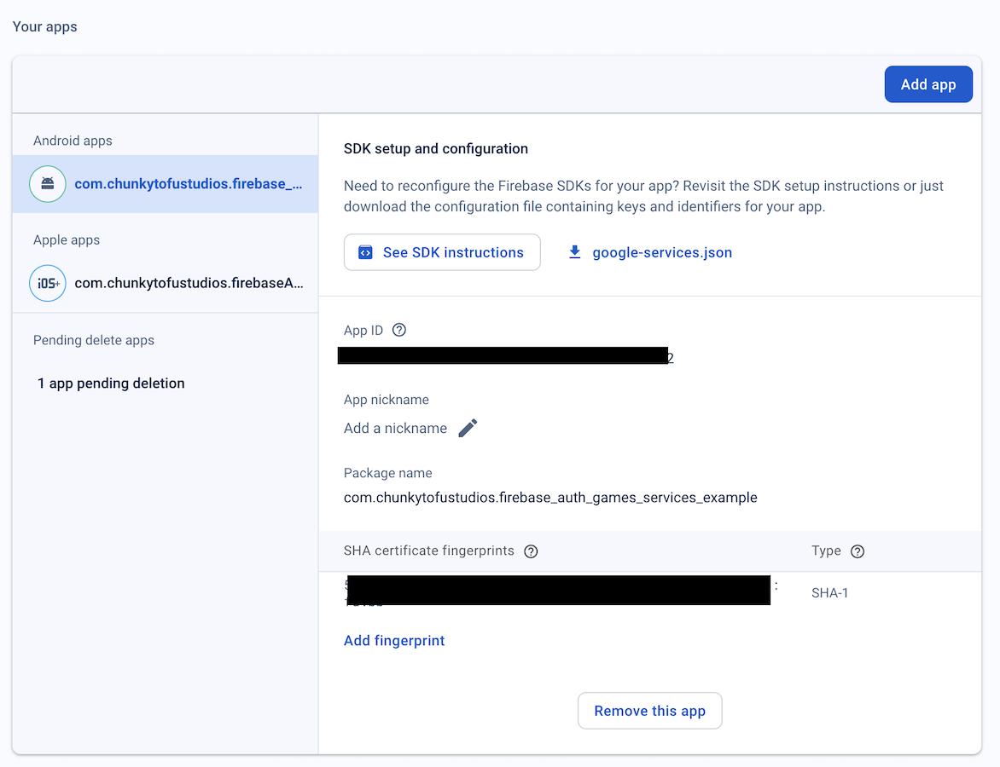
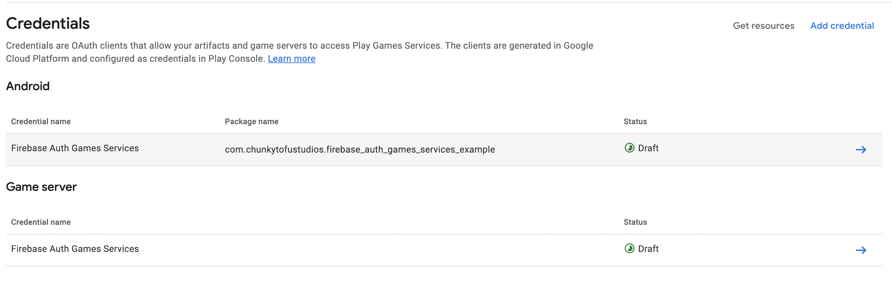

# firebase_auth_games_services

Enables logging into Firebase using Android Play Games and iOS Game Center.

## Glossary

* Games Services: Collective name for Play Games and Game Center.

## Dependencies

This plugin depends on:

* [firebase_core](https://pub.dev/packages/firebase_core)
* [firebase_auth](https://pub.dev/packages/firebase_auth)

Please ensure you have these installed before you begin.

## Installation

Please follow these steps carefully as there are multiple pitfalls that might lead to cryptic error messages. These instructions were taken from official Google/Apple documentation and are subject to change. You can access the original documentation by clicking the **\*** at each step.

### Android configuration

1. Ensure you have added Android and iOS apps to your Firebase project. You can do so via [Firebase console](https://console.firebase.google.com/).

    

1. [*](https://firebase.google.com/docs/auth/android/play-games#set-up-firebase-project) Set the SHA-1 Fingerprint of your Android app in [Firebase console](https://console.firebase.google.com/).

1. [*](https://firebase.google.com/docs/auth/android/play-games#set-up-firebase-project) Enable Google Play Games as a sign-in provider in [Firebase console](https://console.firebase.google.com/). You can find the OAuth2 Client ID and secret at the **Credentials** section of [GCC](https://console.cloud.google.com/apis/credentials) under the name "Web client  (auto created by Google Service)".

1. [*](https://firebase.google.com/docs/auth/android/play-games#configure-play-games-with-firebase-info) [*](https://developer.android.com/games/pgs/console/setup#add_your_game_to_the) Setup Play Games in the [Google Play Console](https://play.google.com/console/developers). Follow the on-screen prompts. When you arrive at the Credentials stage make sure to add 2 credentials: (1) Game server type credential where you use the client ID from the step above; (2) Android type credential where you use the Android credential autogenerated by Firebase.

    

1. [*](https://developer.android.com/games/pgs/console/setup#configure_the_oauth_consent_screen) Configure your OAuth consent screen by following the original directions from Google (<- click the star).

1. Again in the [Google Play Console](https://play.google.com/console/developers) add your Gmail to two distinct tester lists: one in **Testing > Internal testing** and the other in **Play Games Services > Setup and management > Testers**.

1. [*](https://developer.android.com/games/pgs/android/android-signin) Create a `android/app/src/main/res/values/strings.xml` file, if one doesn't exist. To this file add a string resource reference and set your project ID as the value. In Google Play Console, you can find your project ID under your game name in the **Configuration** page. For example:

    ```xml
    <!-- res/values/strings.xml -->
    <resources>
        <!-- Replace 0000000000 with your game’s project id. Example value shown below. -->
        <string translatable="false"  name="game_services_project_id"> 0000000000 </string>
    </resources>
    ```

1. [*](https://firebase.google.com/docs/auth/android/play-games#set-up-firebase-project) To the same file add your OAuth2 Client ID. You can find this at the **Credentials** section of [GCC](https://console.cloud.google.com/apis/credentials) under the name "Web client  (auto created by Google Service)". For example:

    ```xml
    <!-- res/values/strings.xml -->
    <resources>
        <!-- Replace 0000000000 with your game’s project id. Example value shown below. -->
        <string translatable="false"  name="game_services_project_id"> 0000000000 </string>
        <!-- Replace with your OAuth2 Client ID from Google Cloud Console. -->
        <string translatable="false" name="firebase_auth_oauth_2_web_client_id">XXXXXXXX.apps.googleusercontent.com</string>
    </resources>
    ```

1. [*](https://developer.android.com/games/pgs/android/android-signin) In your `android/app/src/main/AndroidManifest.xml` file add the following within the `<application>` element:

    ```xml
    <!-- Required by Play Games SDK to specify application ID. -->
    <meta-data android:name="com.google.android.gms.games.APP_ID"
        android:value="@string/game_services_project_id" />

    <!-- Required by firebase_auth_games_services plugin. -->
    <meta-data
        android:name="com.chunkytofustudios.firebase_auth_games_services.OAUTH_2_WEB_CLIENT_ID"
        android:value="@string/firebase_auth_oauth_2_web_client_id" />
    ```

### iOS configuration

1. [*](https://developer.apple.com/documentation/gamekit/enabling_and_configuring_game_center/) Open your project in XCode. In the **Signing & Capabilities** tab add the "Game Center" capability.

1. [*](https://firebase.google.com/docs/auth/ios/game-center#before_you_begin) Ensure that the bundle ID in [Firebase console](https://console.firebase.google.com/) matches the one listed in XCode.

1.

### Update Firebase config

If you made any changes via Firebase Console or Google Cloud Console run the following command to update your local files:

```bash
flutterfire configure
```
